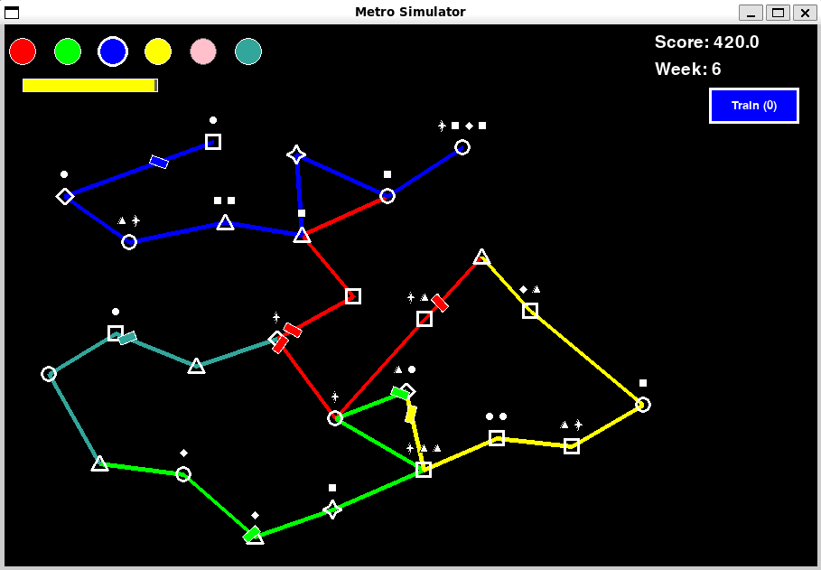

# 🚇 Hybrid Graph State-Space Models in Reinforcement Learning

Oficjalne repozytorium dla projektu badawczego: **"Hybrid Graph State-Space Models in Reinforcement Learning: Attention as a Stabilizer for Dynamic Metro Network Control"**.

Projekt bada zachowanie różnych architektur sieci grafowych (GNN, Graph Transformers, Graph Mamba, Graph Jamba) w środowisku uczenia ze wzmocnieniem (RL), gdzie topologia grafu dynamicznie rośnie w czasie.

##  Środowisko Symulacyjne: Dynamiczna Sieć Metra

Stworzyliśmy dedykowane środowisko zgodne ze standardem **Gymnasium**. Agent RL musi autonomicznie zarządzać rosnącą siecią metra, łącząc nowe stacje (reprezentowane przez figury geometryczne) i zarządzając flotą pociągów, aby zoptymalizować przepływ pasażerów.

*Wizualizacja dynamicznego środowiska symulacji sieci metra. W miarę upływu czasu pojawiają się nowe stacje, wymagające od agenta adaptacji topologii w czasie rzeczywistym.*

##  Główne Wnioski z Badań

Autonomiczne sterowanie w środowisku, gdzie wymiary stanu stale się zmieniają, to duże wyzwanie. Przetestowaliśmy cztery podejścia:

1. **GNN (Baseline):** Działa lokalnie (O(N)). Mocno uzależniony od początkowej inicjalizacji wag, podatny na utknięcie w lokalnych minimach z powodu braku globalnego kontekstu.
2. **Graph Transformer:** Zapewnia najlepsze wyniki dzięki globalnemu mechanizmowi uwagi, ale jego złożoność obliczeniowa (O(N²)) sprawia, że jest bardzo kosztowny w trenowaniu.
3. **Graph Mamba (Czysty SSM):** Cechuje się wydajnością liniową (O(N)) i potrafi uczyć się początkowej polityki, ale w dynamicznym środowisku RL cierpi na **katastrofalne zapadnięcie się polityki (policy collapse)** z powodu dryfu pamięci.
4. **Graph Jamba (Nasza Propozycja):** Architektura hybrydowa łącząca GNN, bloki Mamba oraz mechanizm Attention. **Mechanizm uwagi działa tu jako kluczowy stabilizator**, zapobiegając zapadaniu się polityki i oferując świetny kompromis między wydajnością a stabilnością.

##  Architektura Graph Jamba

Nasz model wykorzystuje trójścieżkowe przetwarzanie równoległe:
* **Gałąź identyczności (GNN):** Ekstrakcja cech lokalnych.
* **Gałąź Mamba:** Liniowe modelowanie sekwencji długoterminowych.
* **Gałąź Attention:** Stabilizacja dryfu stanu ukrytego (wykorzystujemy warianty *Standard Self-Attention* oraz *Linear Attention*).
